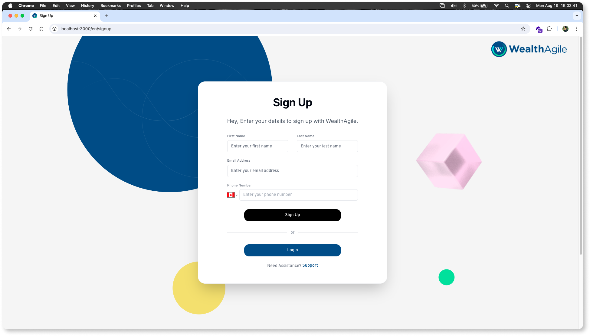
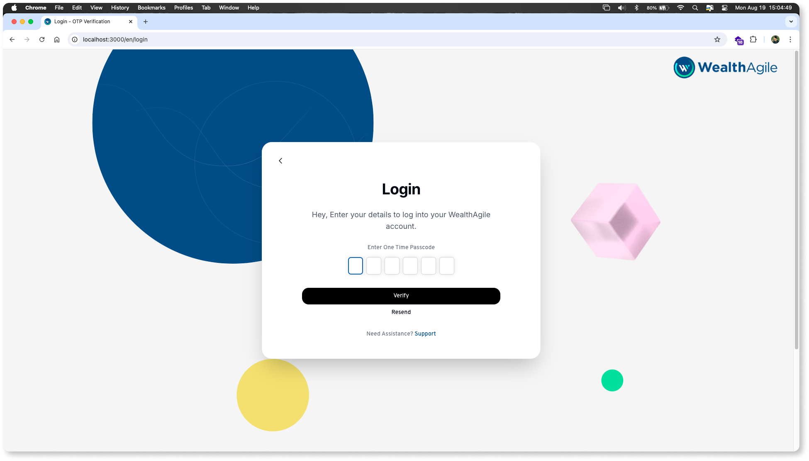
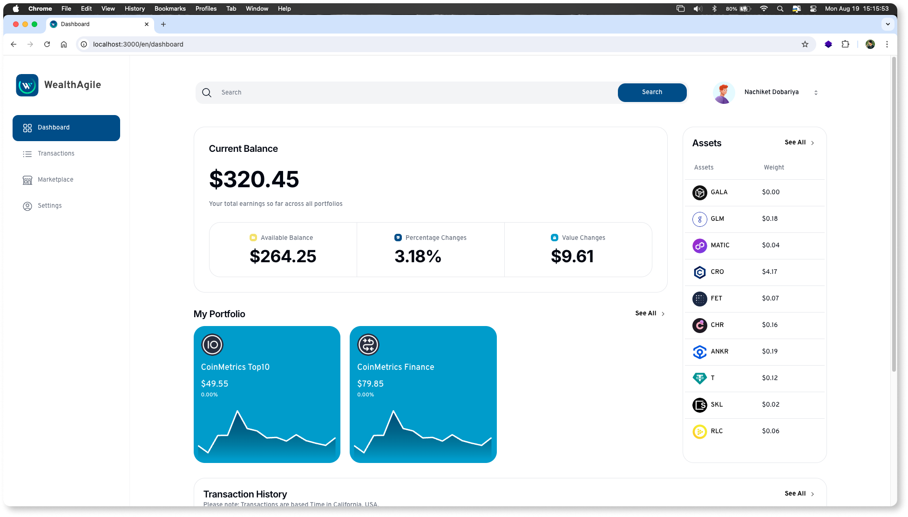
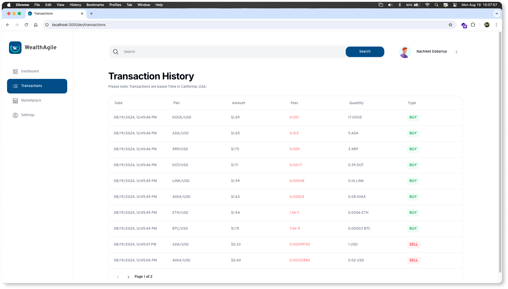
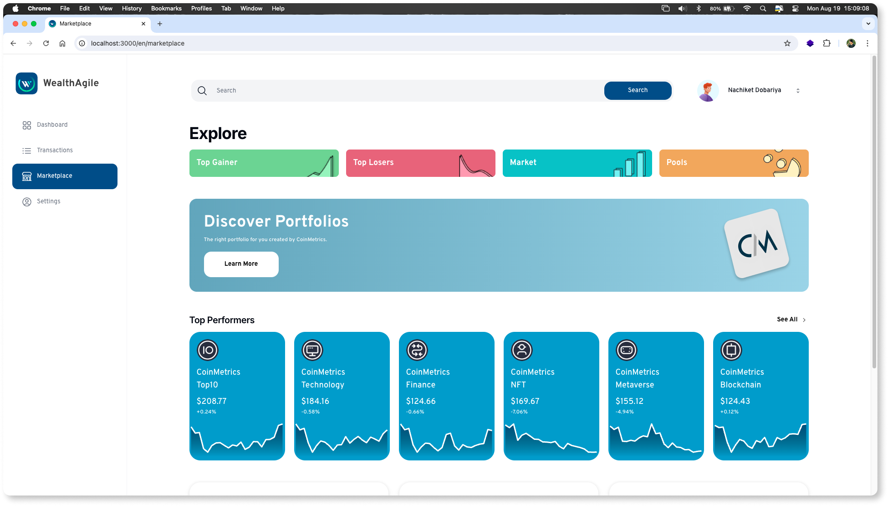
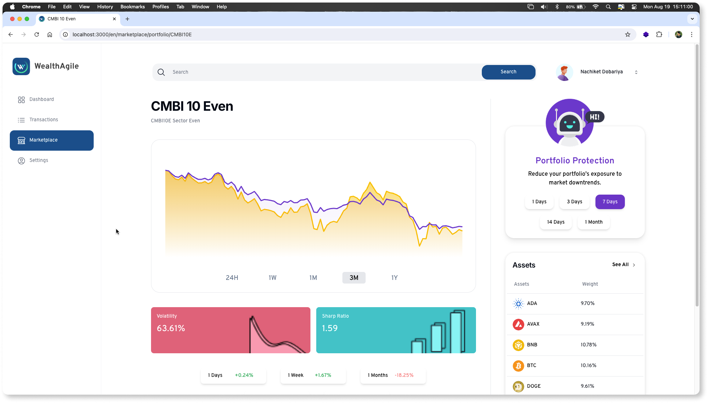
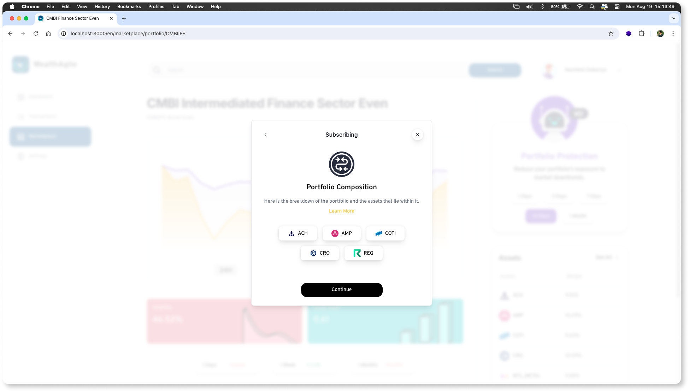
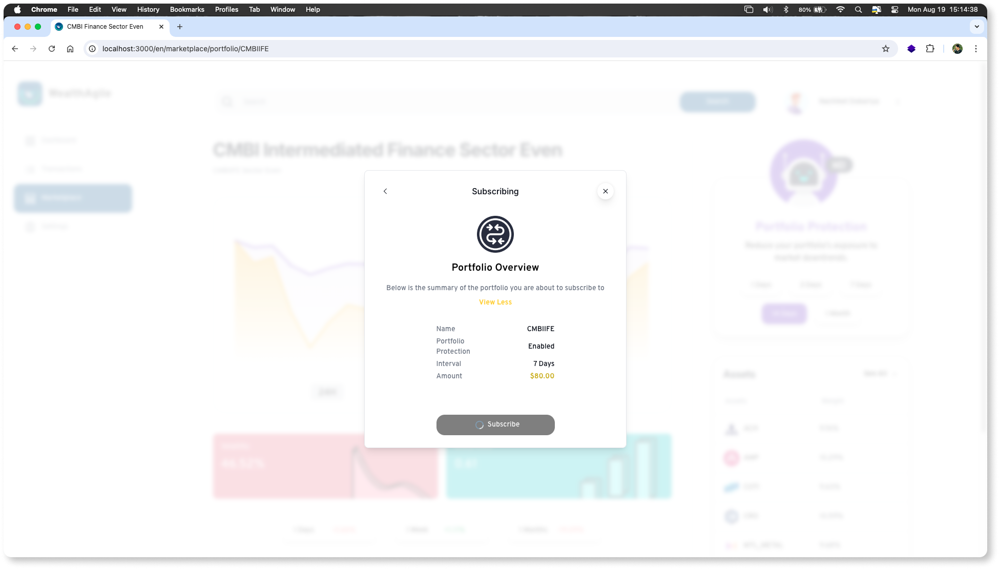
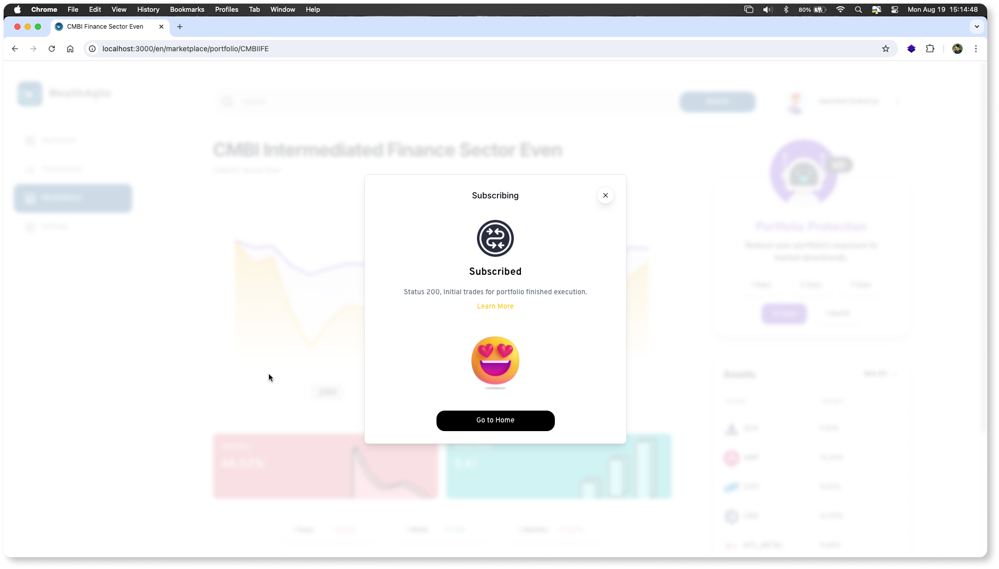

# 🚀 WealthAgile Web Application

## Smart Crypto Made Easy

Welcome to the **WealthAgile Web** version! Our platform is designed to simplify your crypto journey, offering seamless management of your assets with the same ease and intelligence you've come to expect from WealthAgile. Now accessible from any web browser, manage your crypto portfolios efficiently with our user-friendly interface and robust features.

## 💼 What is WealthAgile Web?

Whether you're new to crypto trading or a seasoned investor, our **Index Portfolios** make managing your crypto effortless. The WealthAgile web application provides a comprehensive suite of tools to manage your crypto assets securely on your trusted exchange, all from the convenience of your web browser.

## 🛠️ Technologies Used

The WealthAgile Web application is built with cutting-edge technologies to ensure a smooth and responsive user experience:

- 🌐 **React.js** for dynamic user interfaces
- ⚛️ **Next.js** for server-side rendering and optimized performance
- 💻 **Webpack** for efficient module bundling
- ☁️ **AWS Lambda** for serverless API integrations
- 🎨 **Tailwind CSS** for modern, responsive design
- 🟢 **Node.js** for backend services
- 🔗 **Module Federation** for microfrontend architecture, enabling scalable development

> **Note:** The WealthAgile Web application is currently in development and has not yet been published. The code is being run locally as we continue to refine and enhance the platform.

## 🌐 Connected Exchanges

WealthAgile Web connects with popular exchanges to provide seamless crypto portfolio management:
- **Crypto.com**
- **Coinbase**

## 🚀 Coming Soon

We're excited to bring the WealthAgile experience to your web browser! Stay tuned for updates on the official launch.

## 📸 Screenshots

Explore the WealthAgile Web with these preview images:

  
  
  
  
  
  
  
  
  
  

---
